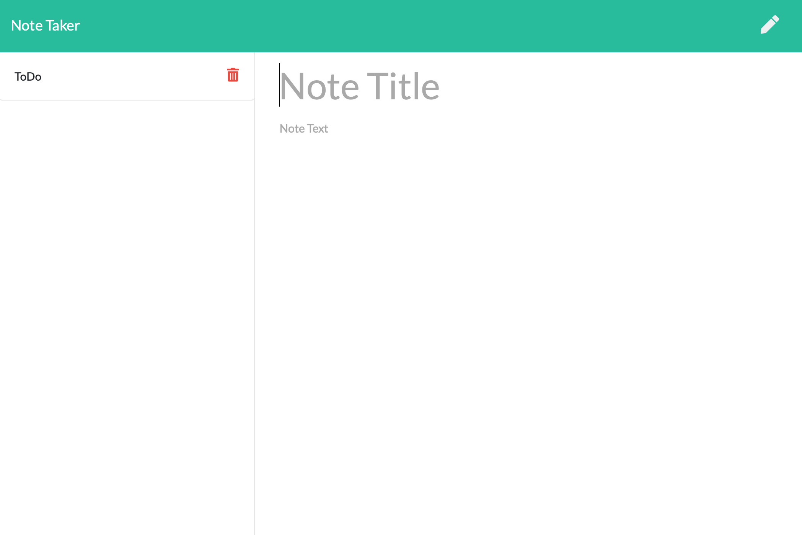

# Note Taker


## Table of Contents
* [Description](#description)
* [Installation](#installation)
* [License](#license)
* [Demo](#demo)
* [Contribution](#contribution)

## Description
This application alows you to save your notes!
It uses Express.js back end and will save and retrieve note data from a JSON file.

## Installation
To install necessary dependecies, run the following command:

```
npm i
```

## License
This project is licensed under the MIT license.

## Made with:
- Express.js
- JavaScript
- HTML
- CSS

## Demo
Here's a [link](https://ataghva-note-taker.herokuapp.com) to deployed application
[]()

## Contribution
Made By Ali Taghva
